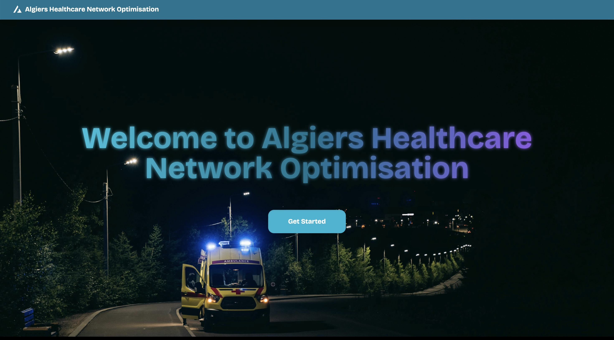
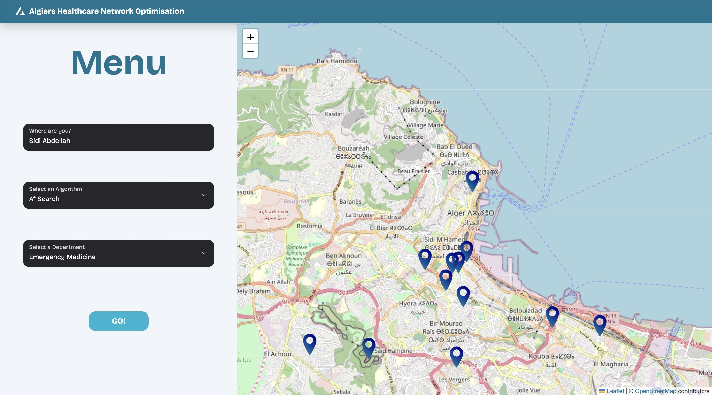

# Algiers Healthcare Network Optimisation

**Algiers HNO** is a **website** that will find the **hospital with the specifications you require for in Algiers** and give you **the** **shortest path** to it. This is an **Intro. to AI** school project proposed by Mr. **Ahmed GUESSOUM** at **the Higher National School of AI (ENSIA)**





## Installation

**1. Create a new environment and Install the requirements**

```bash
conda env create -m Algiers-HNO -f requirements.yaml
conda activate Algiers-HNO
```

**2. Start the Flask server**

```bash
python server/src/app.py
```

**3. Open a new terminal and change the directory**

```bash
cd client
```

**4. Install node_modules**

```bash
npm install
```

**5. Start the NodeJS server**

```bash
npm run dev
```

## Roadmap

- We are working on providing a better user experience
- Expanding the project to serve all states of Algeria is put into consideration

## Contributing

- Pull requests are welcome. For major changes, please open an issue first to discuss what you would like to change.

## License

[MIT](https://choosealicense.com/licenses/mit/)
